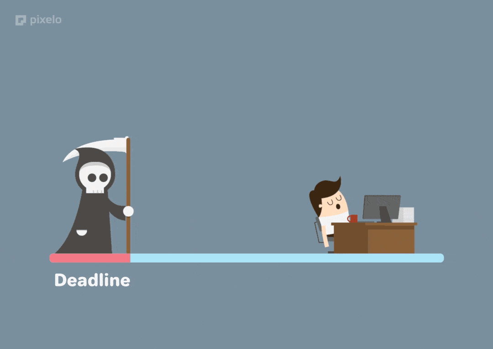

  <b>Hi, I'm Kishlay Kumar — Full-Stack Dev & Tech Explorer.</b> 
  <em>Let's connect and build something awesome!</em>

  

  <b> Let's get connected.</b> 

  
  
  
  
  

 

   

  

    
    
  

  

    
    
  

 

  

